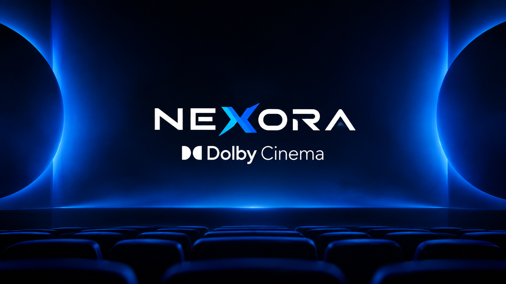

<div align="center">
  
  <h1>🍿 Nexora Dolby Cinema</h1>
  <p><i>A Next-Generation Cinema Ticketing & Management System built with C++, MFC, and Supabase.</i></p>
</div>

---

## 📖 Overview
**Nexora Dolby Cinema** is a premium desktop application built for managing cinema ticket bookings, browsing movie catalogs, and handling secure transactions. Designed with a stunning **glassmorphism UI**, dynamic TMDB poster integrations, and a robust real-time cloud backend, it demonstrates advanced C++ concepts and Object-Oriented Architecture.

## ✨ Key Features
- **🎬 Dynamic Movie Browser**: Fetches movie details and downloads high-quality posters on-the-fly using the TMDB API.
- **🛋️ Interactive Seat Selection**: A visually color-coded grid for reserving seats (Available, Selected, Booked).
- **🔒 Secure Checkout System**: Form validates emails, Mastercard/Visa cards, and CVVs using polymorphic payment processors.
- **🎟️ Digital Ticket Generation**: Instantly generates booking receipts complete with scannable **QR Codes** that can be saved to your local machine.
- **🎥 Embedded Trailer Player**: Watch movie trailers directly inside the application using an embedded player (`mpv`).
- **🛡️ Admin Dashboard**: Secure login for cinema administrators to add, edit, and remove movies and showtimes.
- **🔄 Auto-Reset Scheduler**: Automatically resets and clears past bookings when a new day begins based on real-time clock data.

## 🛠️ Technology Stack
- **Language**: C++ (C++17/20)
- **Framework**: MFC (Microsoft Foundation Classes)
- **UI Rendering**: GDI+ (Custom drawing, glass overlays, alpha blending)
- **Database Backend**: [Supabase](https://supabase.com/) (PostgreSQL via REST API)
- **Networking**: `WinHTTP` for secure HTTPS REST requests
- **JSON Parsing**: `nlohmann/json`
- **Build System**: CMake

## 🏗️ Architecture & Design Patterns
Nexora is built with a clean, scalable architectural pattern:
- **Repository Pattern**: Clean separation of database logic (`MovieRepository`, `ShowtimeRepository`, `BookingRepository`, `SeatRepository`).
- **Singleton Pattern**: Ensures a single, thread-safe instance for the `DatabaseManager`.
- **Polymorphism & Abstraction**: Applied in the `PaymentProcessor` classes to handle varying payment gateways (e.g., `CardPayment`).
- **Multithreading**: Uses background threads for downloading heavy assets (like TMDB posters) to ensure the UI remains buttery smooth.

## 🚀 Getting Started

### Prerequisites
1. **Visual Studio 2022+** (with "Desktop development with C++" and MFC components installed).
2. **CMake** (v3.20+).
3. **Supabase Account**: You will need a Supabase project and an Anon Key.

### Building the Project
1. Clone the repository:
   ```bash
   git clone https://github.com/yourusername/NexoraDolbyCinema.git
   cd NexoraDolbyCinema
   ```
2. Configure with CMake:
   ```bash
   cmake -B out/build/x64-Debug
   ```
3. Build the Application:
   ```bash
   cmake --build out/build/x64-Debug
   ```
4. Run the executable located in `out/build/x64-Debug/NexoraDolbyCinema.exe`.

> **Note**: Ensure the `assets/` folder (containing the logo, background images, and hall images) is located in the same directory as your CMakeLists.txt so the build system can automatically copy them to the output folder.

## 📸 Screenshots
*(Upload your screenshots to your GitHub repo and link them here!)*
- **Home Screen**: `[Insert image]`
- **Movie Selection & Trailers**: `[Insert image]`
- **Seat Booking Grid**: `[Insert image]`
- **Digital Ticket & QR Code**: `[Insert image]`

## 👨‍💻 Admin Access
To access the Admin Dashboard to modify the movie catalog, use the following default credentials (or update them in your Supabase DB):
- **Email**: `Admin`
- **Password**: `2004`

## 📄 License
This project is licensed under the MIT License - see the [LICENSE](LICENSE) file for details.

---
<div align="center">
  <i>Developed with ❤️ for Cinema Enthusiasts.</i>
</div>
